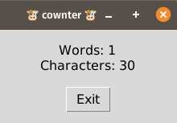

README
======
# 🐮 cownter  
A tiny clipboard monitor that shows live word & character counts.



## Usage  
1. Install: ```pip install pyperclip```  
2. Run: ```python cownter.py```  
3. Copy any text – counts update every 0.7 s.  
4. Press Exit to quit.

## Requirements  
Python 3.x, tkinter (ships with CPython), pyperclip.

## License  
MIT – do what you want.
